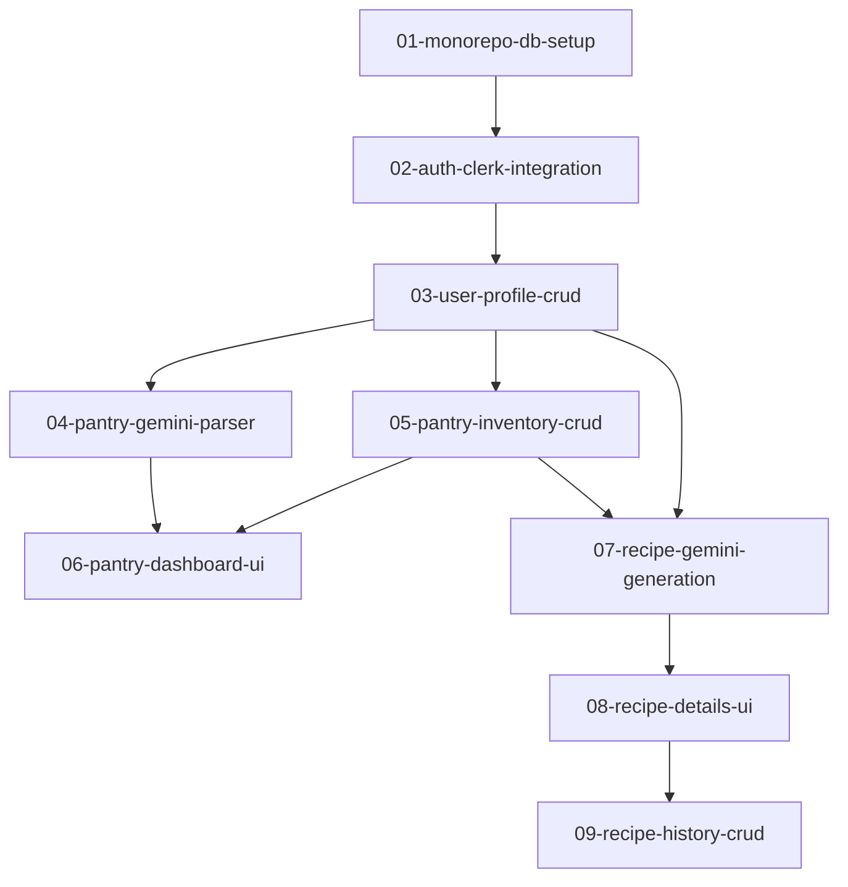

# Roadmap de Desenvolvimento Incremental — FazAI

Este documento apresenta o planejamento incremental e arquitetural para o desenvolvimento da plataforma **FazAI**. O planejamento divide as entregas do PRD em **9 mudanças incrementais independentes**, com risco, complexidade e tamanho delimitados como **baixo/médio**. 

Nenhuma mudança é considerada concluída sem que a tipagem estática TypeScript, o linter e todos os testes correspondentes (unitários, integração e E2E) estejam plenamente implementados e validados.

---

## 1. Visão Geral da Arquitetura e Diretrizes Técnicas

Para garantir o alinhamento com as especificações técnicas (`docs/spec_tech.md`), o design system (`docs/design_system.md`), e o arquivo de diretrizes operacionais do projeto (`AGENTS.md`), as seguintes regras de arquitetura são aplicadas a todas as fases:

*   **Monorepo**: Estrutura unificada com `apps/frontend/` (React, TypeScript, Vite, Tailwind CSS) e `apps/backend/` (Node.js Serverless Functions na Vercel).
*   **Isolamento Lógico (Segurança)**: Todas as consultas de banco de dados (`Prisma Client`) devem ser filtradas estritamente pelo campo `UserId` extraído do token JWT do Clerk nos middlewares de segurança para mitigar vulnerabilidades IDOR.
*   **Integração IA**: Uso obrigatório do SDK oficial do Google Gen AI (`@google/genai`) com o Gemini 1.5 Flash em modo JSON (`responseMimeType: "application/json"` ou delimitadores rígidos).
*   **Sem Mídia Biométrica**: Entrada de dados 100% via texto livre interpretado por IA. Zero lógica de câmera ou upload de fotos de alimentos.
*   **Strict Typing**: É terminantemente proibido o uso de `any` em arquivos `.ts` ou `.tsx`.
*   **Qualidade**: Validação de payload no backend usando `Zod`. No frontend, validação com `Zod` or `Formik`.

---

## 2. Relação com os Protótipos Gráficos (Google Stitch)

As mudanças de interface gráfica herdam os componentes do projeto Stitch **FazAI - Login e Cadastro** (ID do Projeto: `3073037219676603357`):

1.  **INT-001 (Tela de Login e Cadastro)**: Tela Stitch `8c2b8530201f4ee38608e26a0681a22f`
2.  **INT-002 (Tela de Perfil e Restrições)**: Tela Stitch `dfc2ee0ffee140f19f9aa0bb095cf1bd`
3.  **INT-003 (Tela da Despensa Inteligente)**: Tela Stitch `f53df7ea9ba7418193a0f362b8567ee2`
4.  **INT-004 (Tela de Receita Sugerida)**: Tela Stitch `581a2b95685c442ca61a226beb156c90`
5.  **INT-005 (Tela de Histórico de Receitas)**: Tela Stitch `082d2156065b420a8cb74e61a3623165`

---

## 3. Estrutura do Cronograma de Mudanças (Fases de Entrega)

O desenvolvimento está dimensionado nas seguintes mudanças incrementais de risco/complexidade controlado:

### Fase 1: Setup, Autenticação e Perfil de Usuário (v1)
*   **01-monorepo-db-setup**: Setup estrutural do monorepo, inicialização do Prisma ORM e conexão com o PostgreSQL do Supabase, scripts de migração de banco e infraestrutura base de CI/CD.
*   **02-auth-clerk-integration**: Integração do SDK do Clerk no backend para validação de JWT, setup do ClerkProvider no frontend e rotas protegidas básicas.
*   **03-user-profile-crud**: Implementação do modelo `UserProfiles` no Prisma, endpoints `/api/v1/profile` (GET/PUT) com validação Zod e isolamento lógico, e a interface gráfica do Perfil (INT-002) com Tailwind CSS e validação.

### Fase 2: Despensa Inteligente e Parse com Gemini (v2)
*   **04-pantry-gemini-parser**: Implementação do serviço backend com o SDK `@google/genai` e endpoint `POST /api/v1/pantry/parse-text` para conversão de texto livre em lista estruturada de ingredientes com rate limit handling.
*   **05-pantry-inventory-crud**: Modelo `PantryItems` no Prisma, endpoints `/api/v1/pantry` (GET), `/api/v1/pantry/items` (POST), e `/api/v1/pantry/items/:id` (DELETE) com isolamento lógico baseado em Clerk `UserId`.
*   **06-pantry-dashboard-ui**: Interface gráfica da Despensa Inteligente (INT-003) integrando o text area de entrada, spinners de processamento assíncrono, renderização dos ingredientes e chips de exclusão pontual.

### Fase 3: Geração de Receitas e Histórico (v3)
*   **07-recipe-gemini-generation**: Lógica backend do endpoint `POST /api/v1/recipes/generate` que orquestra ingredientes da despensa e restrições de perfil de usuário em um prompt estruturado do Gemini, retornando receitas e dados nutricionais em formato JSON.
*   **08-recipe-details-ui**: Interface gráfica do modo leitura da Receita Sugerida (INT-004), exibindo ingredientes, passo a passo de preparo e o painel grid de métricas nutricionais.
*   **09-recipe-history-crud**: Modelo `SavedRecipes` no Prisma, endpoints `/api/v1/recipes/favorite` (POST/GET), barra de busca textual e a interface gráfica do Histórico (INT-005).

---

## 4. Matriz de Complexidade, Tamanho e Risco

| ID | Mudança | Tamanho | Complexidade | Risco | Foco dos Testes |
| :--- | :--- | :--- | :--- | :--- | :--- |
| **01** | `01-monorepo-db-setup` | Médio | Médio | Médio | Conectividade DB & Builds de CI/CD |
| **02** | `02-auth-clerk-integration` | Médio | Médio | Médio | Middleware de Sessão JWT e Proteção de Rotas |
| **03** | `03-user-profile-crud` | Médio | Médio | Baixo-Médio | Validação Zod & Isolamento por UserId |
| **04** | `04-pantry-gemini-parser` | Médio | Médio | Médio | Tratamento de Erros, Delimitadores JSON & Mock Gemini |
| **05** | `05-pantry-inventory-crud` | Médio | Médio | Baixo | CRUD DB com isolamento por UserId |
| **06** | `06-pantry-dashboard-ui` | Médio | Médio | Baixo-Médio | Fluxo de Entrada, State Sync & Cypress E2E |
| **07** | `07-recipe-gemini-generation` | Médio | Médio | Médio | Prompts Complexos, Restrições & Mock LLM |
| **08** | `08-recipe-details-ui` | Médio | Médio | Baixo | Grid de Macros, Botões de Ação e Tratamento de Erros |
| **09** | `09-recipe-history-crud` | Médio | Médio | Baixo | Favoritar Receita, Filtro de Busca & Fluxo Geral E2E |

---

## 5. Práticas de Linter e Testes Obrigatórios

Cada proposta de mudança define sua suíte de linter e de testes que devem ser obrigatoriamente rodados antes da aprovação do Pull Request correspondente.

*   **Linter**: `npx eslint` nos diretórios do frontend e backend e `npx tsc --noEmit` na raiz para garantir tipagem forte e livre de `any`.
*   **Testes Unitários**: Escritos em Vitest (frontend) ou Jest (backend) focando em lógica pura, transformações de dados e mocks do banco de dados (Prisma Mock) e IA (Gemini Mock).
*   **Testes de Integração**: Testes de rotas HTTP do Express/Fastify (usando `supertest`) e consultas diretas ao banco Supabase em modo teste (transações com rollback ou banco local de testes).
*   **Testes End-to-End (E2E)**: Implementados via Cypress ou Playwright focando nos fluxos completos das telas do Stitch integradas ao banco.
