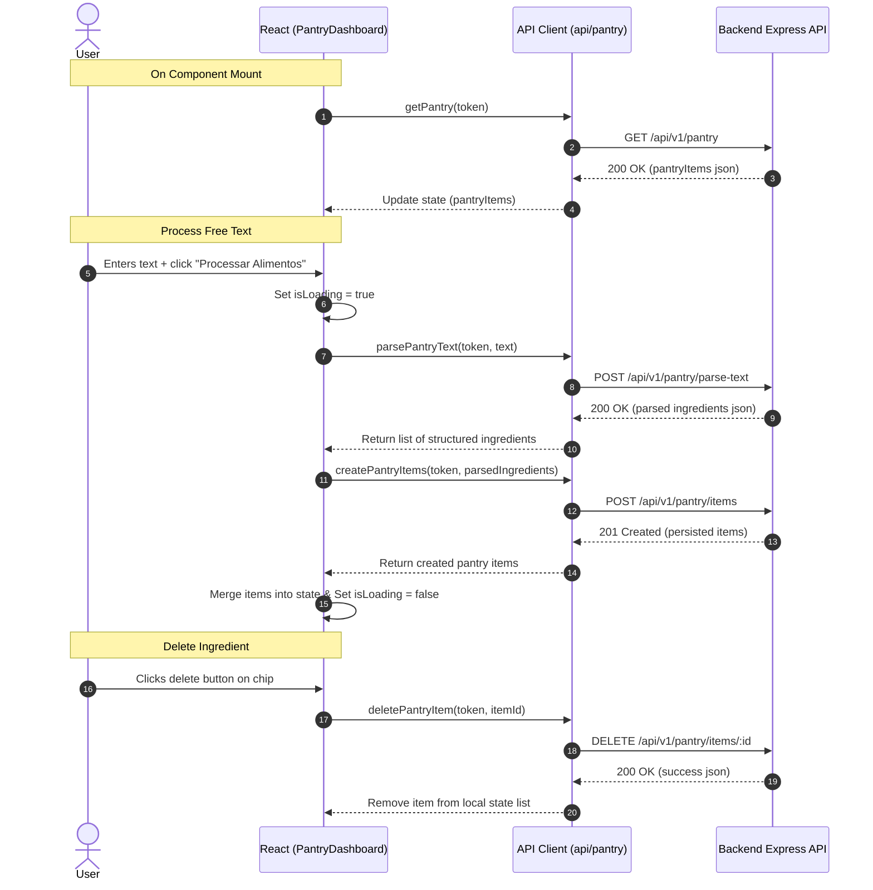

# Design: 06-pantry-dashboard-ui

## Context

The FazAI application requires an interactive frontend interface for the Intelligent Pantry (Stitch INT-003). Currently, the React application has placeholder content for the `/pantry` route. We need to implement a fully functional, responsive, and aesthetically pleasing dashboard that communicates with the backend endpoints created in `04-pantry-gemini-parser` and `05-pantry-inventory-crud` to list, parse, add, and delete pantry ingredients.

## Goals / Non-Goals

**Goals:**
* Implement the `/pantry` dashboard split layout using a mobile-first responsive grid (1 column on mobile, 3 columns asymmetric on desktop).
* Create the `PantryDashboard.tsx` component in `apps/frontend/src/pages/` and integrate it into `App.tsx`.
* Implement the API client module `apps/frontend/src/api/pantry.ts` to interact with `/api/v1/pantry`, `/api/v1/pantry/parse-text`, `/api/v1/pantry/items`, and `/api/v1/pantry/items/:id`.
* Enable free-text ingestion of ingredients processed via backend Gemini parsing with reactive UI updates.
* Display persisted ingredients as chips with inline deletion capabilities.
* Provide interactive feedback (loading spinners, disabled actions, success/error alert banners).
* Ensure strict type safety by avoiding `any` types.

**Non-Goals:**
* Implement the recipe details page or history page (scoped under `08-recipe-details-ui` and `09-recipe-history-crud`).
* Alter backend pantry APIs or DB schemas (pre-configured in previous changes).

## Decisions

### 1. File Structure and Components

* **API Module**: We will create `apps/frontend/src/api/pantry.ts` to encapsulate HTTP requests to the backend server.
* **Dashboard Page**: We will create `apps/frontend/src/pages/PantryDashboard.tsx` to encapsulate the view state and UI layout.
* **Form Validation**: Simple client-side checks for the TextArea input (non-empty, <= 5000 characters) before sending to Gemini parser.

### 2. Layout Structure (INT-003)

Following the *mobile-first* design tokens of FazAI:
* Main Container: `max-w-7xl mx-auto px-4 sm:px-6 lg:px-8` to center contents on large screens.
* Dashboard Grid: `grid grid-cols-1 lg:grid-cols-3 gap-8`
  * **Left Column (2/3 width - `lg:col-span-2`)**:
    * TextArea with custom placeholder: *"Tenho 3 ovos, um maço de espinafre, metade de uma cebola..."*
    * Process Button: Coral primary color `bg-[#ff6b6b] hover:bg-[#e55a5a] text-white`. Disabled when `isLoading` is active.
    * Loading Spinner: Rendered when analyzing/sending to Gemini to provide processing feedback.
  * **Right Column (1/3 width - `lg:col-span-1`)**:
    * Side Card with white background (`bg-white border border-slate-100 rounded-xl p-6`).
    * Dynanic list of active ingredients: Rendered as chips (`bg-slate-50 border border-slate-200 text-slate-800 rounded-lg px-3 py-1.5 flex items-center justify-between`).
    * Deletion action: A trash icon button using red alert colors (`text-red-500 hover:text-red-700`) triggering `DELETE /api/v1/pantry/items/:id`.
  * **Action Footer / CTA**:
    * A prominent button "Gerar Receitas Personalizadas" (using secondary brand color `bg-[#ffd166] hover:bg-[#e6bc5c] text-slate-800 font-semibold py-3 rounded-lg shadow-sm`).
    * Active state constraint: Enabled only when the pantry list contains $\ge 1$ item. On click, it will trigger navigation to `/recipes` (to be implemented in subsequent phases).

### 3. API Communication Flow



### 4. Strict Type Safety

No `any` types will be used. All states and responses are typed:
```typescript
export interface PantryItem {
  id: string;
  userId: string;
  name: string;
  quantity: string | null;
  createdAt: string;
  updatedAt: string;
}

export interface ParsedIngredient {
  name: string;
  quantity: string;
}
```

## Risks / Trade-offs

* **[Risk] Gemini/Backend Request Overlaps / Multi-clicks** → **Mitigation**: A loading overlay or disabling buttons (`disabled={isLoading}`) will freeze actions during pending async operations.
* **[Risk] Gemini Parser returns incorrect formats** → **Mitigation**: Validated in backend via Zod schemas. If the parser fails, the frontend catches the error (including 429 rate limit or 502 parse failures) and outputs an explicit error message: *"Ocorreu um erro ou limite atingido ao gerar sua receita. Por favor, tente novamente em alguns instantes."*
* **[Risk] Mobile View Layout Squishing** → **Mitigation**: The list card will stack beneath the text input card on viewports smaller than desktop (`lg` Tailwind breakpoint) to prevent layout break.
